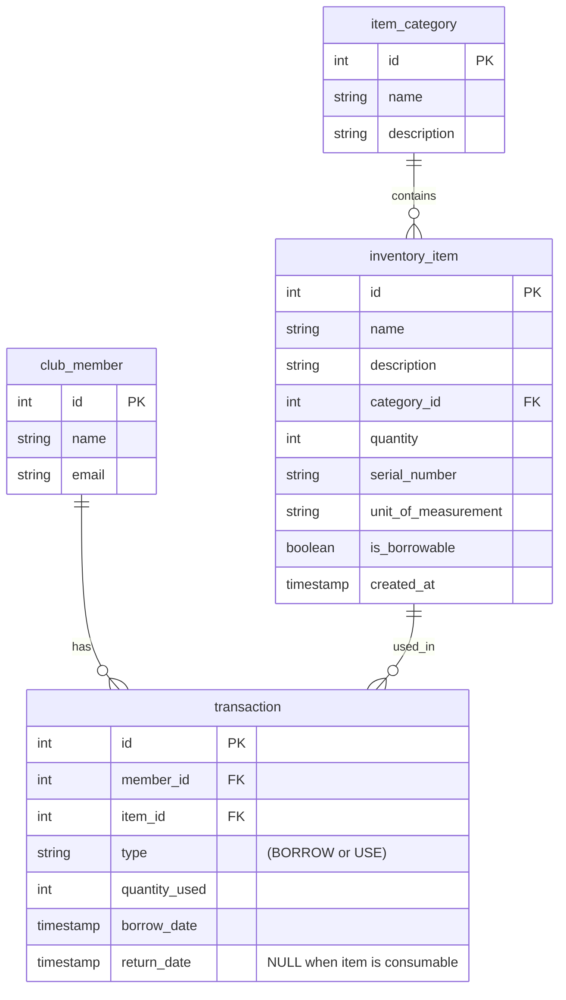

# Inventory Management System

The client has requested the development of an **Inventory Management System** for a **Radio Control School Club**. The system must support **inventory tracking, borrowing, and returning of equipment**.

### **Glossary**
- **Member** – A club member identified by **names** and **email**.
- **Item** – A unit of **RC equipment or tools** that can either be **used by members** or **borrowed for a specific period**.
- **Item Characteristics** – Each item has the following attributes:
   - **Name** (*mandatory*)
   - **Brief Description** (max **128 characters**)
   - **Quantity** (*non-null, trackable*)
   - **Unit of Measurement** (e.g., pieces, grams, millilitre)
   - **Category** (e.g., Batteries, Tools, Spare Parts)
   - **Borrowing Status** (indicates whether the item can be **borrowed** or **used only within the club**)
   - Date of when item is **Added to System**
- **Transaction** – The action of **borrowing or using an item**, recorded for tracking purposes.

This structure ensures **efficient inventory tracking**, **availability monitoring**, and **seamless borrowing management** for club members.

**NB**: This lab will be focused on developing a Java Project that covers project architecture design

**Note**: For the students feeling more comfortable with the language you can think how to split Inventory Item to Borrowable and Consumable

### **Inventory Item Details**
- **Id** (Auto-incremented)
- **Name** (Mandatory, up to 100 characters)
- **Description** (Optional, up to 255 characters)
- **Quantity** (Must be non-negative)
- **Serial Number** (Unique String value)
- **Unit of Measurement** (e.g., "pcs", "kg", "milliliters")
- **Category** (e.g., "Batteries", "Motors", "Tools")
- **Borrowable** (Boolean flag to indicate if the item can be borrowed)
- **Added Date** (Timestamp)

### **Club Member Details**
- **Id** (Auto-incremented)
- **First Name**
- **Last Name**
- **Email** (Must be unique, properly formatted)

### **Transaction Details**
- **Id** (Auto-incremented)
- **Member** (Reference to Club Member)
- **Item** (Reference to Inventory Item)
- **Borrowed Date**
- **Due Date**
- **Returned** (Boolean flag indicating if the item was returned)

---

Example of a DB Schema


For simplicity some of the columns are simple strings, but you can create new entity objects as future improvements

## **Define Your Project Structure**

### **Create Entities**
1. Create a `model` package where all entity objects will reside.
2. Implement the following entity objects:
   - **InventoryItem**
   - **ClubMember**
   - **Transaction**
   - **ItemCategory**

---

### **Create Repositories**
1. Create a `repository` package to manage all operations related to data storage and retrieval.
2. Implement basic **CRUD** operations:

#### Example: **InventoryItemRepository**
```java
public class InventoryItemRepository {
    private static Map<Integer, InventoryItem> itemTable = new HashMap<>();

    /**
     * Adds a new inventory item to the repository.
     * @param item The item to be added.
     */
    public void addItem(InventoryItem item) {
    }

    /**
     * Deletes an inventory item by its ID.
     * @param id The ID of the item to be deleted.
     * @return true if item was successfully deleted, false otherwise.
     */
    public boolean deleteItemById(Integer id) {
    }

    /**
     * Retrieves an inventory item by its ID.
     * @param id The ID of the item.
     * @return An Optional containing the item if found.
     */
    public Optional<InventoryItem> getItemById(Integer id) {
    }

    /**
     * Returns all inventory items in the repository.
     * @return List of all inventory items.
     */
    public List<InventoryItem> getAllItems() {
    }
}
```

---

### **Create Services**
Create a `service` package where all business logic will be implemented. The goal of the Service package will be to expose the Repository CRUD functionalities and all additional business logic
We will focus to Inventory and Transaction services.
#### Example: **InventoryService**
```java
public interface InventoryService {
    /**
     * Retrieves all inventory items.
     * @return List of all items in inventory.
     */
    List<InventoryItem> getAllItems();

    /**
     * Adds a new item to the inventory.
     * @param name The name of the item.
     * @param description The item's description.
     * @param quantity The quantity available.
     * @param unit The unit of measurement.
     * @param category The category of the item.
     * @param borrowable Whether the item can be borrowed.
     */
    void addItem(String name, String description, int quantity, String unit, String category, boolean borrowable);

    // add all all operations from the CRUD operation
    
     
   // Continue with the business related functions
    /**
     * Retrieves all inventory items that are low in stock.
     * @param threshold The threshold quantity to determine low stock.
     * @return List of inventory items below the threshold.
     */
    List<InventoryItem> getLowStockItems(int threshold);
    
    /**
     * Updates an existing inventory item.
     * @param updatedItem The updated item details.
     * @return true if update was successful, false otherwise.
     */
    public boolean updateItem(InventoryItem updatedItem);
    
}
```

#### **TransactionService**
```java
public interface TransactionService {
    /**
     * Records a transaction when an item is borrowed.
     * @param member The club member borrowing the item.
     * @param item The item being borrowed.
     * @param days The number of days the item is borrowed for.
     */
    void borrowItem(ClubMember member, InventoryItem item, int days);

    /**
     * Retrieves all transactions in the system.
     * @return List of all transactions.
     */
    List<Transaction> getAllTransactions();

    /**
     * Marks a borrowed item as returned.
     * @param transactionId The ID of the transaction being completed.
     * @return true if the return was successful, false otherwise.
     */
    boolean returnItem(Integer transactionId);

    /**
     * Retrieves a list of all overdue transactions.
     * @return List of overdue transactions.
     */
    List<Transaction> getOverdueTransactions();
}
```

---

### **Extra Features**
- **Implement a method in `TransactionService` to return an item and update inventory.**
- **Create a method in `InventoryService` to find all low-stock items** (low-stock is considered each item with less than 10 peaces (quantity) or 100 ml (liquids)).
- **Extend `ClubMemberRepository` to check for duplicate emails before adding a member.**
- **Add a method in `TransactionRepository` to retrieve overdue transactions.**
- **Add a `Controller layer` to simulate outbound control to the application**  
- **Using your `Controller classes` manipulate the "DB" and test your functionalities in a main method**

---

## **Summary of Week-03-Lab Tasks**
✅ **Define Entities** (`InventoryItem`, `ClubMember`, `Transaction`)

✅ **Implement Repository Layer** (`InventoryItemRepository`, `ClubMemberRepository`, `TransactionRepository`)

✅ **Develop Service Layer** (`InventoryService`, `TransactionService`)

✅ **Develop Controller Layer** (`InventoryController`, `TransactionController`)

✅ **Implement Additional Features and Manual Testing from Main**

---
