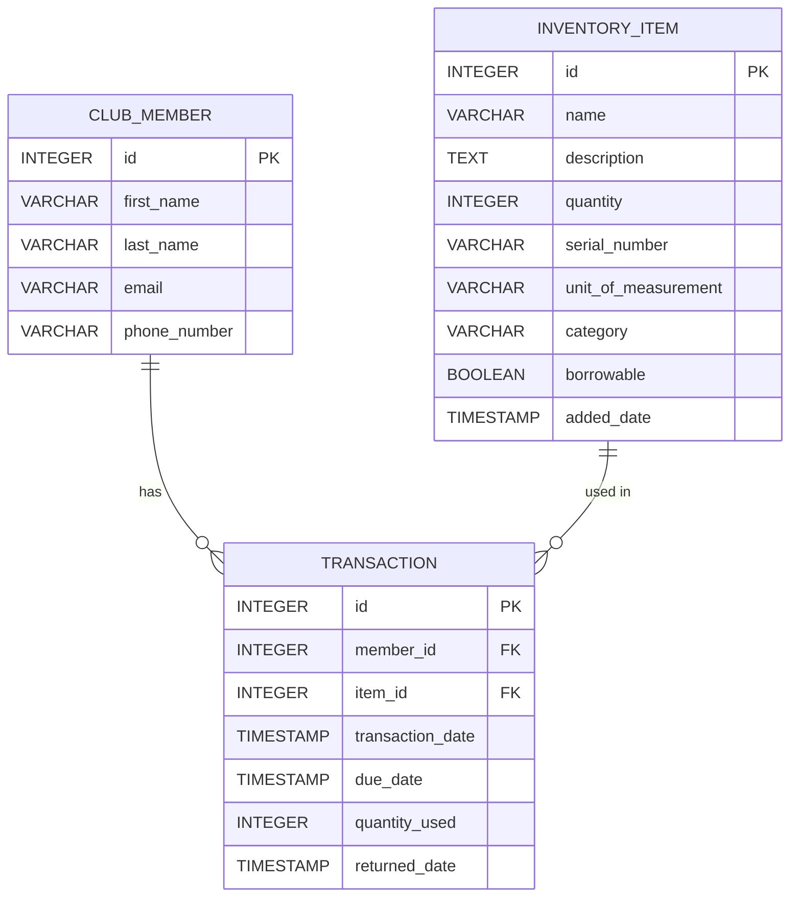

# Spring Boot + PostgreSQL DB Integration & Refactoring Tasks

This guide walks you through integrating your Spring Boot application with a **PostgreSQL** database, defining a robust schema for an **Inventory Management System**, and refactoring your codebase for best practices and maintainability.

---

## Task 0: Setup Your Local Database

- Install and run **PostgreSQL** on your machine.
- You may use Docker or native installation.
- 📚 [PostgreSQL setup guide](https://github.com/dreamix-fmi-course-2024/web-development-with-java-lab/blob/main/lab08/postgresql.md)

---

## Task 1: Create the Database and Schema

- Create the database and user.
- Default PostgreSQL port is 5432 (your setup may use 5433).
- Use database name: `inventory-system`.

**Schema Includes:**
- `inventory_item`
- `club_member`
- `transaction`

---

## Task 2: Visualize Entity Relationships

### 🗃 Entity Relationship Diagram (ERD)



---

## Task 3: Integrate Spring Boot with PostgreSQL

1. **Add dependencies** for PostgreSQL and Spring JPA in your `pom.xml`.
2. **Configure** `application.properties`:
    ```properties
    spring.datasource.url=jdbc:postgresql://localhost:5433/inventory-system
    spring.datasource.username=postgres
    spring.datasource.password=pgadmin
    spring.datasource.driver-class-name=org.postgresql.Driver

    spring.jpa.hibernate.ddl-auto=validate
    spring.jpa.show-sql=true
    spring.jpa.properties.hibernate.format_sql=true

    # Load initial schema and data
    spring.sql.init.mode=always
    # never - don't search for data initialization
    # always - always execute data initialization
    spring.sql.init.schema-locations=classpath:db/init.sql
    spring.sql.init.data-locations=classpath:db/data.sql
    ```

---

## Task 4: Define JPA Entities and DTOs

- Create entity classes using `@Entity`, `@Id`, `@Column`.
- Add DTOs for API layer data transfer.
- Use Lombok (`@Data`, `@NoArgsConstructor`, `@AllArgsConstructor`) and Java `record` for DTOs where suitable.

---

## Task 5: Implement Repositories and Refactor Services

- Replace in-memory storage with `JpaRepository` for all entities.
- Refactor service logic to use repositories.

---

## Task 6: Refactor Transaction Model for Return Date

- Update the `Transaction` entity to use a nullable `returnedDate` (`TIMESTAMP`) instead of a boolean.
- Ensure service logic and API reflect this change.

---

## Task 7: Add Borrowing Type to TransactionDto

- Update your `TransactionDto` (the object returned by your API for transaction operations) to include an `itemType` field.
    - This field should be set to `"BORROWABLE"` if the item is borrowable, or `"CONSUMABLE"` if not.
- Ensure that all endpoints returning a transaction (including when a transaction is returned) include this field in the response.
- The mapping should be handled in the `fromEntity` static method of `TransactionDto`, e.g.:
    ```java
    public static TransactionDto fromEntity(Transaction transaction) {
        String itemType = transaction.getItem().isBorrowable() ? "BORROWABLE" : "CONSUMABLE";
        return new TransactionDto(
            transaction.getId(),
            transaction.getItem().getId(),
            transaction.getMember().getId(),
            transaction.getQuantityUsed(),
            transaction.getTransactionDate(),
            transaction.getDueDate(),
            transaction.getReturnedDate(),
            itemType
        );
    }
    ```
- This allows clients to easily distinguish between borrowable and consumable transactions in all API responses.

---

## Task 8: Add Phone Number to ClubMember

- Add a `phoneNumber` column to the `club_member` table and update the entity, DTO, and demo data accordingly.

---

## Task 9: Logging and Exception Handling

- Use your `Logger` to trace calls to create/update items and transactions.
- Handle exceptions via `@ControllerAdvice` or `@ExceptionHandler`.

---

## Task 10: Test and Seed Data

- Use provided SQL scripts to seed demo data.
- Test all endpoints for CRUD and transaction flows.

---

## 💡 Tips

- Use your `InventoryItem` entity as a test subject before applying changes system-wide.
- Build incrementally and test each step.

---

## 🗃 Example DB Diagram

> You can embed a diagram via:
```

```

---

## 📦 SQL Scripts

<details>
<summary><strong>📂 Click to expand SQL schema + seed scripts</strong></summary>

```sql
-- Insert initial ClubMembers
INSERT INTO club_member (first_name, last_name, email, phone_number) VALUES
  ('John', 'Doe', 'john.doe@example.com', '+359888111222'),
  ('Jane', 'Smith', 'jane.smith@example.com', '+359888333444');

-- Insert initial InventoryItems
INSERT INTO inventory_item (name, description, quantity, serial_number, unit_of_measurement, category, borrowable, added_date) VALUES
  ('RC Airplane', 'Remote controlled airplane', 10, 'SN12345', 'PIECE', 'AIRPLANE', true, NOW()),
  ('Drone Set', 'Quadcopter drone set', 5, 'SN67890', 'SET', 'DRONE', true, NOW()),
  ('Propeller', 'Spare propeller for airplane', 100, 'SN54321', 'PIECE', 'ACCESSORY', false, NOW());

-- Insert initial Transactions
INSERT INTO transaction (member_id, item_id, transaction_date, due_date, quantity_used, returned_date) VALUES
  (1, 1, NOW(), NOW() + INTERVAL '7 days', 1, NULL),
  (2, 2, NOW(), NOW() + INTERVAL '7 days', 1, NULL),
  -- Consumable usage: member 1 uses 3 Propellers (item_id 3, which is not borrowable)
  (1, 3, NOW(), NOW(), 3, NULL);

-- Create table for ClubMember
DROP TABLE IF EXISTS transaction;
DROP TABLE IF EXISTS inventory_item;
DROP TABLE IF EXISTS club_member;

CREATE TABLE IF NOT EXISTS club_member (
    id SERIAL PRIMARY KEY,
    first_name VARCHAR(255) NOT NULL,
    last_name VARCHAR(255) NOT NULL,
    email VARCHAR(255) NOT NULL UNIQUE,
    phone_number VARCHAR(32)
);

-- Create table for InventoryItem
CREATE TABLE IF NOT EXISTS inventory_item (
    id SERIAL PRIMARY KEY,
    name VARCHAR(255) NOT NULL,
    description TEXT,
    quantity INTEGER NOT NULL,
    serial_number VARCHAR(255),
    unit_of_measurement VARCHAR(50) NOT NULL,
    category VARCHAR(50) NOT NULL,
    borrowable BOOLEAN NOT NULL,
    added_date TIMESTAMP NOT NULL
);

-- Create table for Transaction
CREATE TABLE IF NOT EXISTS transaction (
    id SERIAL PRIMARY KEY,
    member_id INTEGER NOT NULL REFERENCES club_member(id),
    item_id INTEGER NOT NULL REFERENCES inventory_item(id),
    transaction_date TIMESTAMP NOT NULL,
    due_date TIMESTAMP NOT NULL,
    quantity_used INTEGER NOT NULL,
    returned_date TIMESTAMP
);

-- Add indexes for performance
CREATE INDEX IF NOT EXISTS idx_transaction_member_id ON transaction(member_id);
CREATE INDEX IF NOT EXISTS idx_transaction_item_id ON transaction(item_id);
```

</details>

---